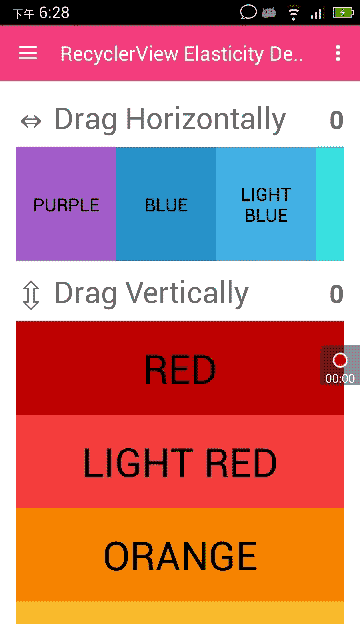

# 首先申明：这个库是基于 [Over-Scroll](https://github.com/EverythingMe/overscroll-decor)

---

# Elasticity 支持 Android 原生控件 RecyclerView, ListView, GridView, ScrollView ...
 
这个库可以让几乎所有的 Android View 具有类似 MIUI 系统里面的一个弹性拉伸的效果。具体的效果可以参考下面的动图。



# Gradle 依赖

在你的项目的 `build.gradle` 文件添加如下内容:
```groovy
allprojects {
    repositories {
        ...
        maven { url "https://jitpack.io/com" }
    }
}
```

在你的 module 的 `build.gradle` 文件中添加如下内容:

```groovy
dependencies {
    // ...
    
    compile 'me.everything:overscroll-decor-android:1.0.3'
}
```

# 使用

### RecyclerView
支持线性和瀑布流的 layout managers，可以很容易接入。实例接入代码如下：

```java
RecyclerView recyclerView = (RecyclerView) findViewById(R.id.recycler_view);
    
// Horizontal
ElasticityHelper.setUpOverScroll(recyclerView, ORIENTATION.HORIZONTAL);
// Vertical
ElasticityHelper.setUpOverScroll(recyclerView, ORIENTATION.VERTICAL);
```

### RecyclerView items 的 swiping / dragging 支持
查看 _高级用法_ .


### ListView

```java
ListView listView = (ListView) findViewById(R.id.list_view);
ElasticityHelper.setUpOverScroll(listView);
```

### GridView

```java
GridView gridView = (GridView) findViewById(R.id.grid_view);
ElasticityHelper.setUpOverScroll(gridView);
```

### ViewPager

```java
ViewPager viewPager = (ViewPager) findViewById(R.id.view_pager);
ElasticityHelper.setUpOverScroll(viewPager);
```

### ScrollView, HorizontalScrollView

```java
ScrollView scrollView = (ScrollView) findViewById(R.id.scroll_view);
ElasticityHelper.setUpOverScroll(scrollView);
    
HorizontalScrollView horizontalScrollView = (HorizontalScrollView) findViewById(R.id.horizontal_scroll_view);
ElasticityHelper.setUpOverScroll(horizontalScrollView);
```

### 任何 View - Text, Image... (可以认为一开始就是 Over-Scroll 状态)

```java
View view = findViewById(R.id.demo_view);
    
// Horizontal
ElasticityHelper.setUpStaticOverScroll(view, ORIENTATION.HORIZONTAL);
// Vertical
ElasticityHelper.setUpStaticOverScroll(view, ORIENTATION.VERTICAL);
```

# 高级用法

```java
// Horizontal RecyclerView
RecyclerView recyclerView = (RecyclerView) findViewById(R.id.recycler_view);
new HorizontalElasticityBounceEffect(new RecyclerViewElasticityAdapter(recyclerView));

// ListView (vertical)
ListView listView = (ListView) findViewById(R.id.list_view);
new VerticalElasticityBounceEffect(new AbsListViewElasticityAdapter(listView));

// GridView (vertical)
GridView gridView = (GridView) findViewById(R.id.grid_view);
new VerticalElasticityBounceEffect(new AbsListViewElasticityAdapter(gridView));

// ViewPager
ViewPager viewPager = (ViewPager) findViewById(R.id.view_pager);
new HorizontalElasticityBounceEffect(new ViewPagerElasticityAdapter(viewPager));

// A simple TextView - horizontal
View textView = findViewById(R.id.title);
new HorizontalElasticityBounceEffect(new StaticElasticityAdapter(view));
```

### RecyclerView 借助 [ItemTouchHelper](http://developer.android.com/reference/android/support/v7/widget/helper/ItemTouchHelper.html) 实现 item swiping / dragging
理论上可以很好的支持 item swiping / dragging (based on [ItemTouchHelper](http://developer.android.com/reference/android/support/v7/widget/helper/ItemTouchHelper.html))， 但是还是建议按如下代码使用。

```java
// Normally you would attach an ItemTouchHelper & a callback to a RecyclerView, this way:
RecyclerView recyclerView = (RecyclerView) findViewById(R.id.recycler_view);
ItemTouchHelper.Callback myCallback = new ItemTouchHelper.Callback() {
	...
};
ItemTouchHelper myHelper = new ItemTouchHelper(myCallback);
myHelper.attachToRecyclerView(recyclerView);

// INSTEAD of attaching the helper yourself, simply use the dedicated adapter c'tor, e.g.:
new VerticalElasticityBounceEffect(new RecyclerViewElasticityAdapter(recyclerView, myCallback));

```

查看更多的 swiping / dragging 原理, 可以参考 [this useful tutorial](https://medium.com/@ipaulpro/drag-and-swipe-with-recyclerview-b9456d2b1aaf).

### Over-Scroll Listeners
提供 2 种监听的方式来获取滚动过程中的状态，具体如下

#### State-Change Listener
状态改变监听，通过这个监听回调，你可以知道状态的改变，使用范例如下：

```java

// Note: over-scroll is set-up using the helper method.
IElasticity elasticity = ElasticityHelper.setUpOverScroll(recyclerView, ORIENTATION.HORIZONTAL);

elasticity.setOverScrollStateListener(new IElasticityStateListener() {
    @Override
	public void onOverScrollStateChange(IElasticity elasticity, int oldState, int newState) {
	    switch (newState) {
	        case STATE_IDLE:
	            // No over-scroll is in effect.
	            break;
	        case STATE_DRAG_START_SIDE:
	            // Dragging started at the left-end.
	            break;
	        case STATE_DRAG_END_SIDE:
	            // Dragging started at the right-end.
	            break;
	        case STATE_BOUNCE_BACK:
	            if (oldState == STATE_DRAG_START_SIDE) {
	                // Dragging stopped -- view is starting to bounce back from the *left-end* onto natural position.
	            } else { // i.e. (oldState == STATE_DRAG_END_SIDE)
	                // View is starting to bounce back from the *right-end*.
	            }
	            break;
	    }
	}
}
```

#### Real-time Updates Listener
滑动过程监听，可以监听滑动过程中手势的具体变化。

```java
// Note: over-scroll is set-up by explicity instantiating a decorator rather than using the helper; The two methods can be used interchangeably for registering listeners.
IElasticity elasticity = new VerticalElasticityBounceEffect(new RecyclerViewElasticityAdapter(recyclerView, itemTouchHelperCallback));

elasticity.setOverScrollUpdateListener(new IElasticityUpdateListener() {
    @Override
    public void onOverScrollUpdate(IElasticity elasticity, int state, float offset) {
    	final View view = elasticity.getView();
    	if (offset > 0) {
    		// 'view' is currently being over-scrolled from the top.
    	} else if (offset < 0) {
    		// 'view' is currently being over-scrolled from the bottom.
    	} else {
    		// No over-scroll is in-effect.
    		// This is synonymous with having (state == STATE_IDLE).
    	}
    }
});

```

这两个监听可以单独使用，也可以同时使用，具体看你的需求。

### 自定义 Views

```java
public class CustomView extends View {
    // ...
}
    
final CustomView view = (CustomView) findViewById(R.id.custom_view);
new VerticalElasticityBounceEffect(new IElasticityAdapter() {

    @Override
    public View getView() {
        return view;
    }

    @Override
    public boolean isInAbsoluteStart() {
	    // canScrollUp() is an example of a method you must implement
        return !view.canScrollUp();
    }

    @Override
    public boolean isInAbsoluteEnd() {
	     // canScrollDown() is an example of a method you must implement
        return !view.canScrollDown();
    }
});
```

### 完全自定义

```java
/// Make over-scroll applied over a list-view feel more 'stiff'
new VerticalElasticityBounceEffect(new AbsListViewElasticityAdapter(view),
        5f, // Default is 3
        VerticalElasticityBounceEffect.DEFAULT_TOUCH_DRAG_MOVE_RATIO_BCK,
        VerticalElasticityBounceEffect.DEFAULT_DECELERATE_FACTOR,
        VerticalElasticityBounceEffect.MAX_SCALE_FACTOR);
                
// Make over-scroll applied over a list-view bounce-back more softly
new VerticalElasticityBounceEffect(new AbsListViewElasticityAdapter(view),
        VerticalElasticityBounceEffect.DEFAULT_TOUCH_DRAG_MOVE_RATIO_FWD,
        VerticalElasticityBounceEffect.DEFAULT_TOUCH_DRAG_MOVE_RATIO_BCK,
        -1f // Default is -2,
        VerticalElasticityBounceEffect.MAX_SCALE_FACTOR);

```

## 感谢

App icons by <a href="http://somerandomdude.com/work/iconic/">P.J. Onori</a>,
<a href="http://graphicriver.net/item/wirecons-vector-icons/4586710?ref=tmthymllr">Timothy Miller</a>,
<a href="http://icons4android.com">Icons4Android</a>, 
<a href="http://icons8.com/android-icons">Icons8.com</a>
